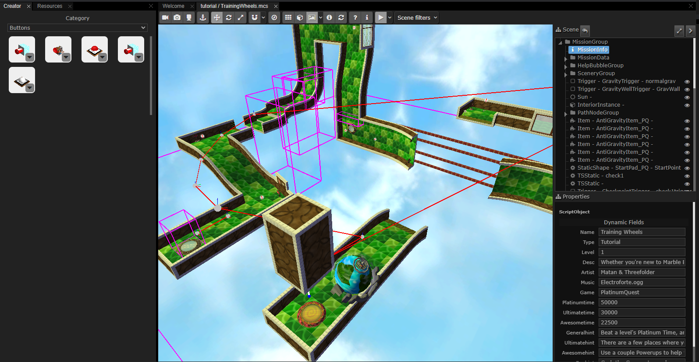

# HIDE - MarbleBlast

HIDE - MarbleBlast is fork the HIDE editor by Shiro Games, adding Marble Blast support to it.

## Contents

- [HIDE - MarbleBlast](#hide---marbleblast)
  - [Contents](#contents)
  - [Preparing your Marble Blast](#preparing-your-marble-blast)
  - [Starting](#starting)

## Preparing your Marble Blast
The datablocks folder contains the necessary json configuration files that you must put in your copy of Marble Blast to enable the editor's support for it.  
For Marble Blast Gold: Copy datablocks-mbg.json folder to MBG/marble folder and rename it to datablocks.json  
For PlatinumQuest: Copy datablocks-pq.json folder to PlatinumQuest/platinum folder and rename it to datablocks.json  
For Marble Blast Ultra: The mbu folder contains the compatible folder structure that you must open in the editor instead. MBU support is strictly limited to that folder due to file format differences in the OpenMBU distribution.

## Starting
Open HIDE by running hide.cmd and you will be greeted by the following window.

Click on Open Folder and navigate to your Marble Blast's marble/platinum folder in its root directory containing the datablocks.json file. The file tree on the left will automatically be populated with the directory contents.

Navigate to a mission and double click on any of the mis/mcs file to open them.

