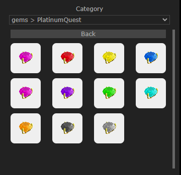
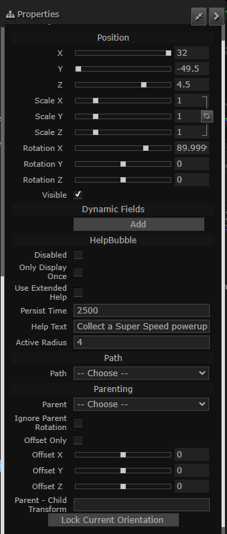

# Layout and Keyboard Shortcuts

## Contents
- [Layout and Keyboard Shortcuts](#layout-and-keyboard-shortcuts)
  - [Contents](#contents)
  - [Toolbar](#toolbar)
    - [Orange: Creator Pane](#orange-creator-pane)
    - [Green: Mission Tree](#green-mission-tree)
    - [Blue: Properties Pane](#blue-properties-pane)
    - [Right Click Menu](#right-click-menu)
  - [Keyboard Shortcuts](#keyboard-shortcuts)

## Toolbar
1. Perspective Camera  
2. Camera Settings  
  
You can change the camera FOV, flight speed, minimum and maximum rendering distance from this menu.  
It also allows you to change the camera behaviour:
- FPS: Normal camera movement behaviour, first person. WASD to move, Right click to rotate camera, middle click to pan.
- Fly/6DOF: similar to normal camera movement but the direction of 'up' is no longer fixed, six degrees of freedom. WQSD to move, AE to roll the camera, right click to rotate camera.
- Orthographic: Shows scene in orthographic projection. Right click to pan. Middle Click/Alt + Right Click to orbit camera around the pivot. Scroll wheel to zoom in and out.
- Classic: Camera orbits around a fixed point. WASD to move, Right click to pan, Middle click/Alt + Right Click to orbit camera around the pivot. Scroll wheel to zoom in and out.
Pressing "Preview Camera Path" shows the animation of the camera path which will be shown in PlatinumQuest's level select. Press any key to cancel the preview animation.  
1. Top Camera: Show top view.  
2. Snap to Ground: Drop created objects to ground plane.  
3. Translation Gizmo  
4. Rotation Gizmo  
5. Scale Gizmo  
6. Snapping: Allows setting snapping grid in the options.  
   Force on Grid: Whether to force the object to grid coordinates when moving or not.
7. Local Transforms: Orient the axes of the Gizmo to the selected object's orientation.  
8.  Toggle Grid: Toggles the visibility of a grid.  
9.  Toggle Model Axis: Show selected model's axis or not.  
10. Toggle Icon Visible: toggles 3d icons in the editor, not of much use.  
11. Toggle Scene Information: Shows technical information about the scene on the corner.  
12. Auto Synchronize: Automatically save the mis file when changes are made.  
13. Shortcuts Help: Shows the keyboard shortcuts.  
14. Edit MissionInfo:  Edit the level's MissionInfo fields, varies with games.  
  
The checkboxes on the left determine whether they are to be saved to MissionInfo object or not.
1.  Animate: Play/Stop the Moving Platform / PathNode animation. Also allows seeking to a particular poing in time.
2.  Scene Filters: Filter visibilities of various categories of objects.

### Orange: Creator Pane
You can use the creator pane to add Items and Static Shapes to the scene.  Drag and drop to place them on the scene.  It also supports selecting skins for shapes that support them.

### Green: Mission Tree
The mission tree shows the hierarchy of objects in the MissionGroup.
Double click on any item to focus the 3d scene on it.  
Supports Ctrl and Shift to select multiple items.  
Right clicking any item yields the following menu:

Visible: Whether it is visible in the editor or not.  
Locked: Whether it can be selected through the 3d scene or not.  
Select all: selects all objects in the mission tree.  
Select children: selects all children in a SimGroup.  
Rename: renames the selected item.  
Delete: deletes the selected item.  
Duplicate: duplicates the selected item.  
Isolate: Hides all the other items in the 3d scene except the selected.  
Group: Creates a new SimGroup from the selected objects.  

### Blue: Properties Pane
It allows you to edit the properties of the selected object, just like in the Torque's editor.

### Right Click Menu

On right clicking, you can create new objects at the cursor by navigating the context menu as shown above.

## Keyboard Shortcuts
- Ctrl + C: Copy Objects
- Ctrl + V: Paste Objects
- Escape: Deselect Selection
- Ctrl + A: Select All
- Ctrl + D: Duplicate Selection
- Ctrl + Shift + D: Duplicate Selection to cursor selected location.
- Ctrl + G: Create SimGroup from Selection.
- Delete: Delete Selection
- Ctrl + F: Search objects
- F2: Rename selected object.
- F: Focus camera on the selection.
- L: Toggle Lasso Selection. Press once to enable the lasso, then move your cursor around to form the lasso, and click to select all the objects under the lasso.
- H: Toggle visibility of Selection
- Ctrl + H: Make all objects visible
- I: Isolate Selection. Hide all objects not in Selection.
- Backspace: Select the parent object of the Selection.
- Ctrl + Shift + F: Gather Selection to cursor.