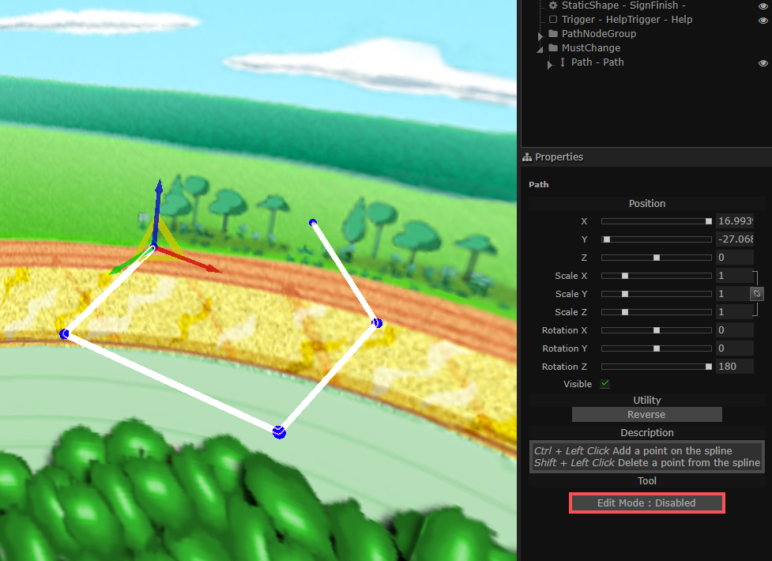
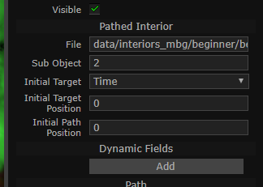
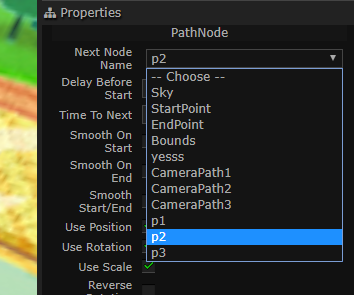

# Particular Features

This section is dedicated to explaining the features of the editor that are specific to Marble Blast.

## Contents
- [Particular Features](#particular-features)
  - [Contents](#contents)
  - [Creating Moving Platforms](#creating-moving-platforms)
  - [Cannon](#cannon)
  - [Path Nodes](#path-nodes)
  - [Assigning Paths and Parenting](#assigning-paths-and-parenting)
  - [PhysMod](#physmod)

## Creating Moving Platforms
To create a Moving Platform, you must first create the hierarchy it requires.  
Create the SimGroup that will contain the Moving Platform and the Path.  
  
Now you can rename this SimGroup as you wish. Then create the Path object.
  
Drag the Path object that you just created into the SimGroup that you created earlier.  
  
Now select the Path object and build the path by using the "Edit Mode" button.  
  
Now right click the SimGroup and create a "PathedInterior".  
Navigate to the .dif file containing the interior you want to use.  
Drag the PathedInterior back inside the SimGroup if it was created outside of it.  
  
Your moving platform is now created.  
  
You can alter its properties from the properties pane.  
  

## Cannon
The editor also provides support for cannons.  
Create a cannon using the Creator panel.  
  
You can also edit its yaw/pitch by simply using the Rotate tool.  

## Path Nodes
It also supports PlatinumQuest path nodes.  
Create the path nodes through the Creator panel and assign them names.  
  
  
Then simply edit their "Next Node Name" property to link them together.  
  
  
Bezier curves are also supported.  
  

## Assigning Paths and Parenting
You can assign a path to an object by modifying its "Path" property.  You can also parent objects to each other by using the "Parent" property.  
  

## PhysMod
The editor also supports PhysMod triggers.  

