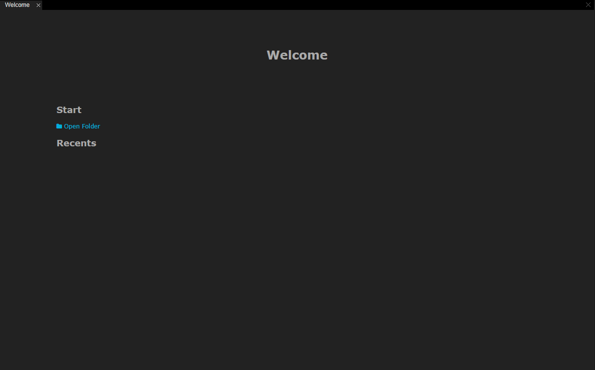
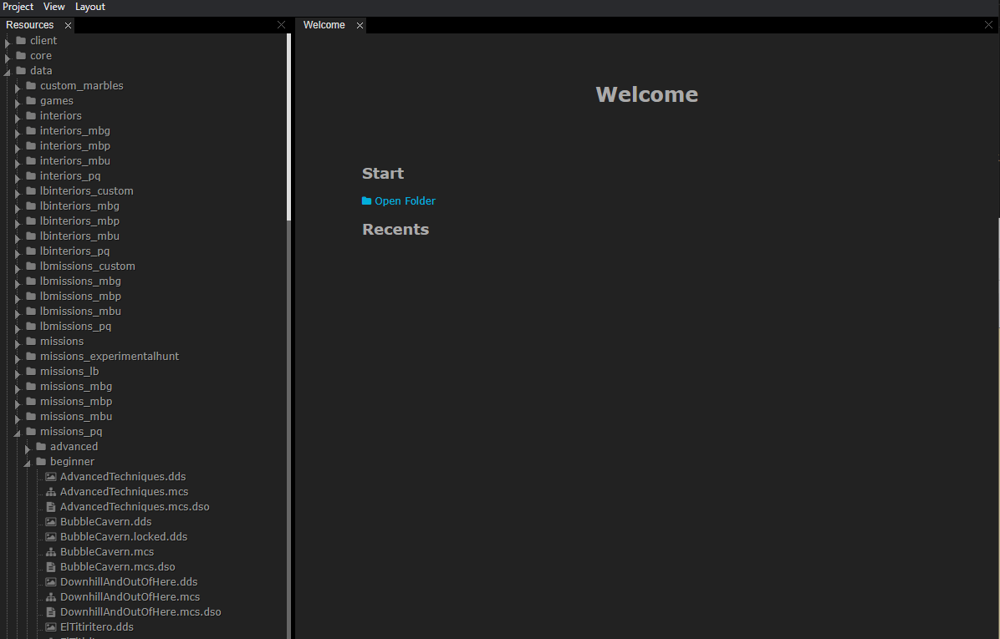
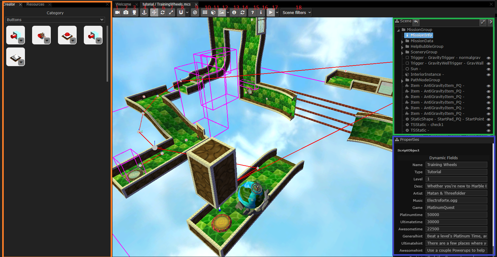
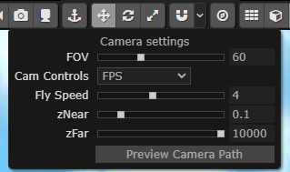
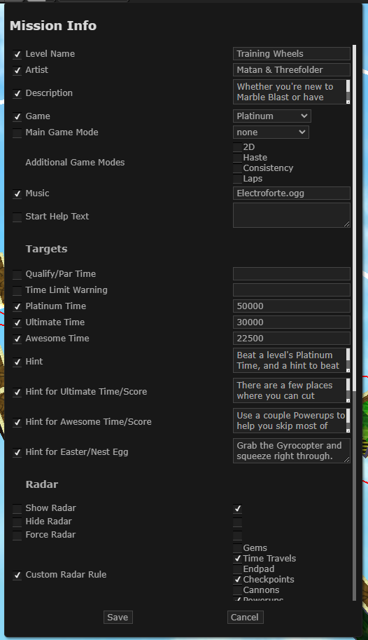
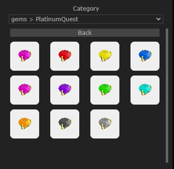
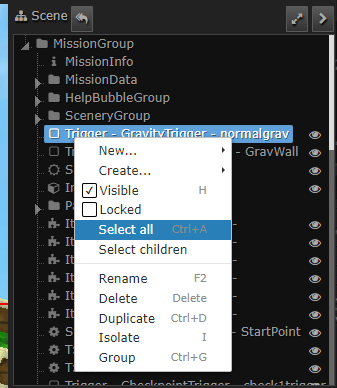
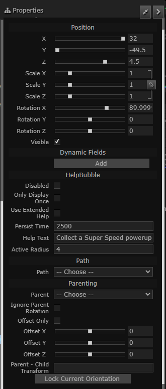
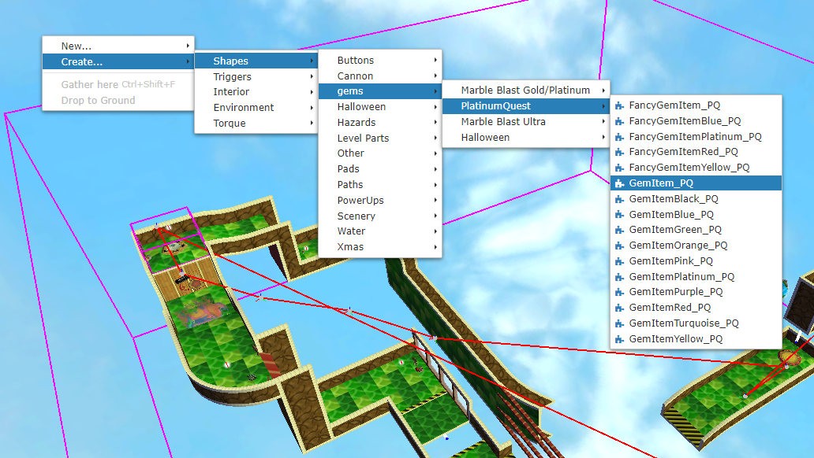

# HIDE - MarbleBlast

HIDE - MarbleBlast is fork the HIDE editor by Shiro Games, adding Marble Blast support to it.

## Contents
TODO

## Preparing your Marble Blast
The datablocks folder contains the necessary json configuration files that you must put in your copy of Marble Blast to enable the editor's support for it.  
For Marble Blast Gold: Copy datablocks-mbg.json folder to MBG/marble folder and rename it to datablocks.json  
For PlatinumQuest: Copy datablocks-pq.json folder to PlatinumQuest/platinum folder and rename it to datablocks.json  
For Marble Blast Ultra: The mbu folder contains the compatible folder structure that you must open in the editor instead. MBU support is strictly limited to that folder due to file format differences in the OpenMBU distribution.

## Starting
Open HIDE by running hide.cmd and you will be greeted by the following window.

Click on Open Folder and navigate to your Marble Blast's marble/platinum folder in its root directory containing the datablocks.json file. The file tree on the left will automatically be populated with the directory contents.

Navigate to a mission and double click on any of the mis/mcs file to open them.

## Layout

## Toolbar
1. Perspective Camera  
2. Camera Settings  
  
Pressing "Preview Camera Path" shows the animation of the camera path which will be shown in PlatinumQuest's level select. Press any key to cancel the preview animation.  
3. Top Camera: Show top view.  
4. Snap to Ground: Drop created objects to ground plane.  
5. Translation Gizmo  
6. Rotation Gizmo  
7. Scale Gizmo  
8. Snapping: Allows setting snapping grid in the options.  
9. Local Transforms: Orient the axes of the Gizmo to the selected object's orientation.  
10. Toggle Grid: Toggles the visibility of a grid.  
11. Toggle Model Axis: Show selected model's axis or not.  
12. Toggle Icon Visible: toggles 3d icons in the editor, not of much use.  
13. Toggle Scene Information: Shows technical information about the scene on the corner.  
14. Auto Synchronize: Automatically save the mis file when changes are made.  
15. Shortcuts Help: Shows the keyboard shortcuts.  
16. Edit MissionInfo:  Edit the level's MissionInfo fields, varies with games.  
  
The checkboxes on the left determine whether they are to be saved to MissionInfo object or not.
17. Animate: Play/Stop the Moving Platform / PathNode animation. Also allows seeking to a particular poing in time.
18. Scene Filters: Filter visibilities of various categories of objects.

### Orange: Creator Pane
You can use the creator pane to add Items and Static Shapes to the scene.  Drag and drop to place them on the scene.  It also supports selecting skins for shapes that support them.

### Green: Mission Tree
The mission tree shows the hierarchy of objects in the MissionGroup.
Double click on any item to focus the 3d scene on it.  
Supports Ctrl and Shift to select multiple items.  
Right clicking any item yields the following menu:

Visible: Whether it is visible in the editor or not.  
Locked: Whether it can be selected through the 3d scene or not.  
Select all: selects all objects in the mission tree.  
Select children: selects all children in a SimGroup.  
Rename: renames the selected item.  
Delete: deletes the selected item.  
Duplicate: duplicates the selected item.  
Isolate: Hides all the other items in the 3d scene except the selected.  
Group: Creates a new SimGroup from the selected objects.  

### Blue: Properties Pane
It allows you to edit the properties of the selected object, just like in the Torque's editor.

### Right Click Menu

On right clicking, you can create new objects at the cursor by navigating the context menu as shown above.